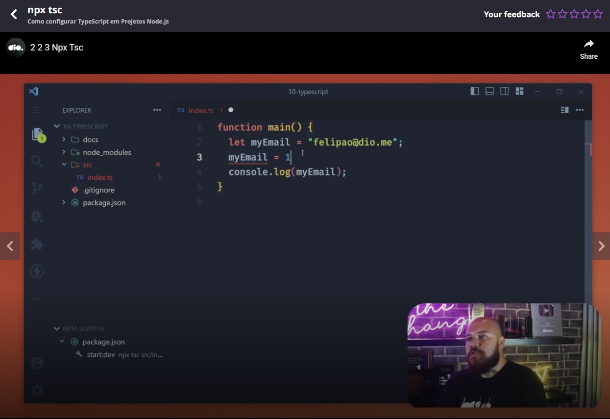
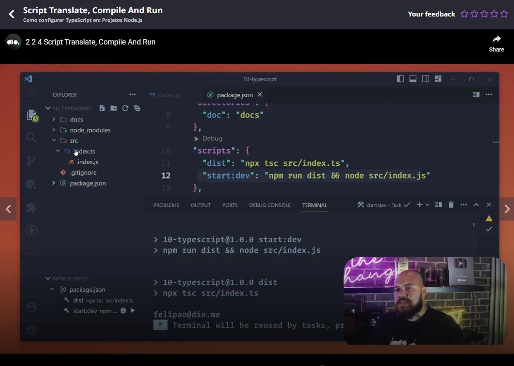
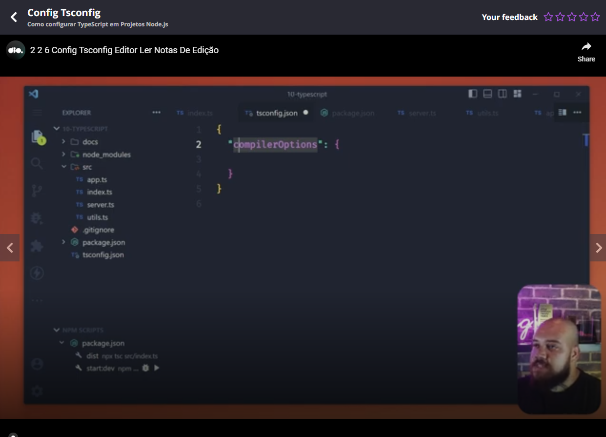
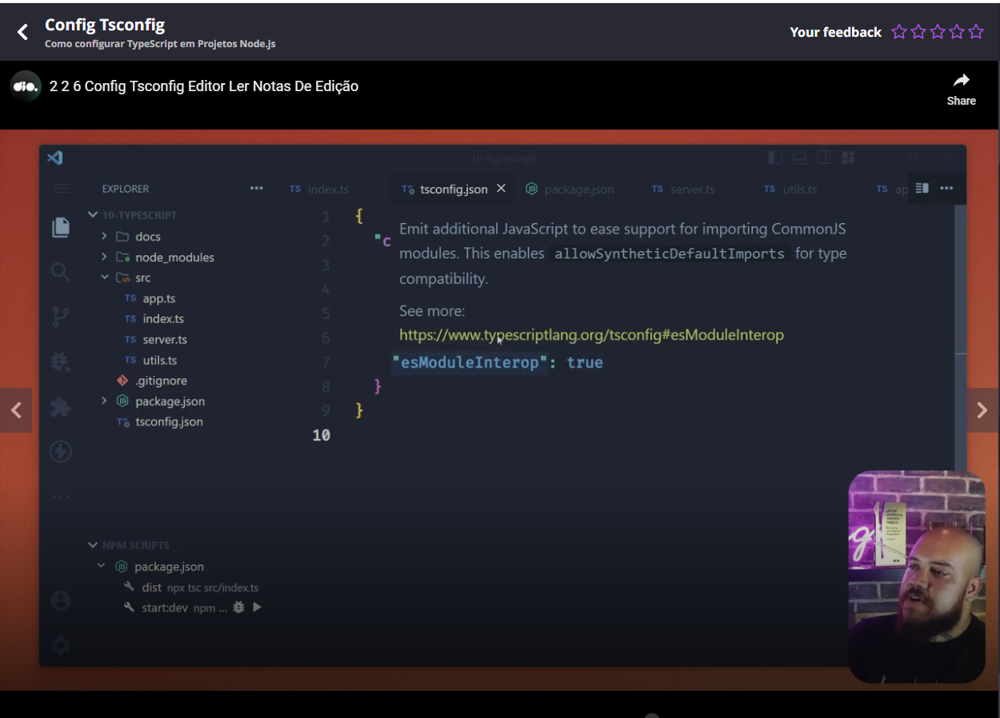
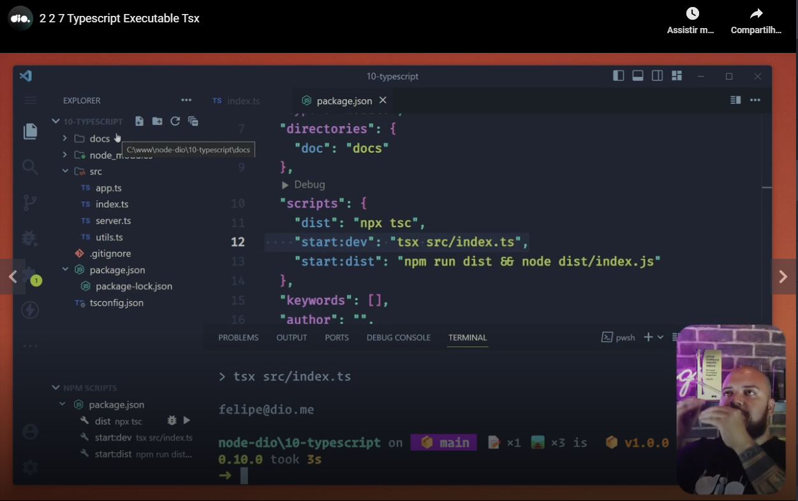
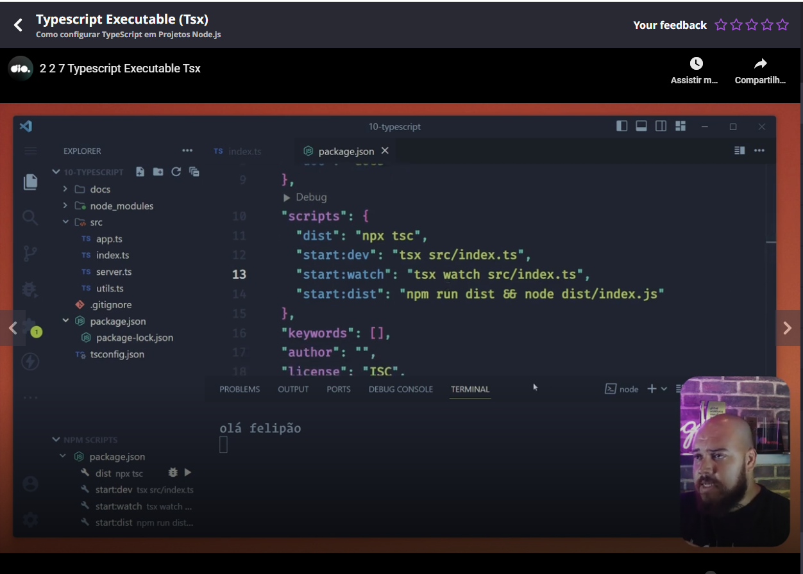
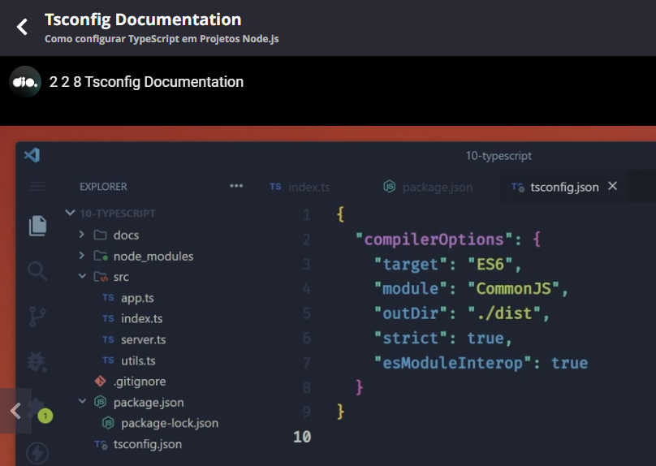
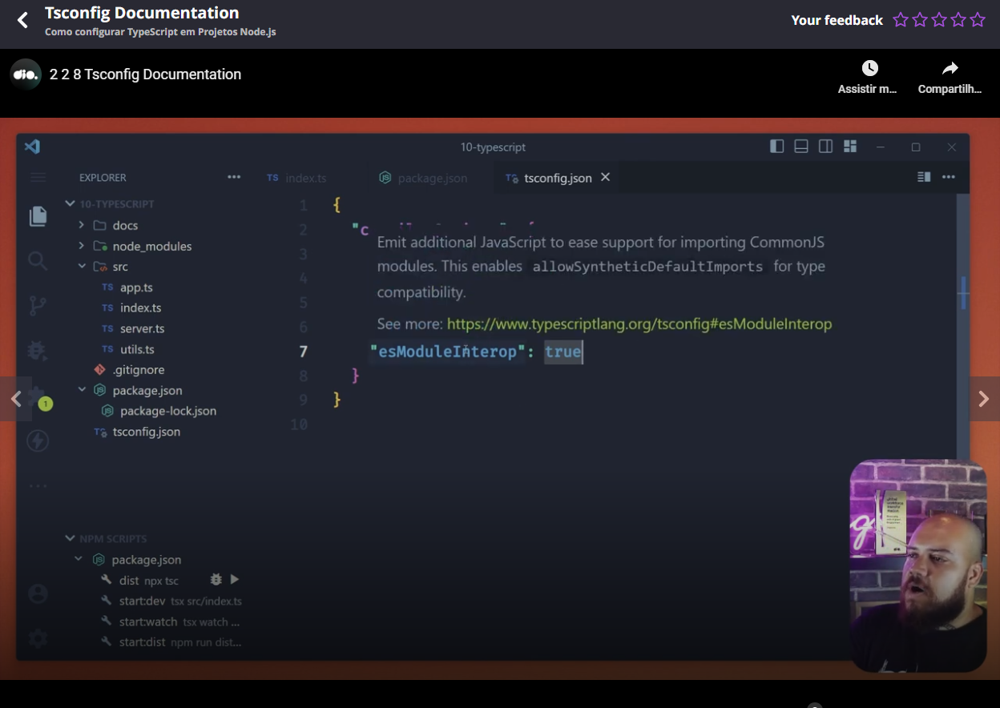
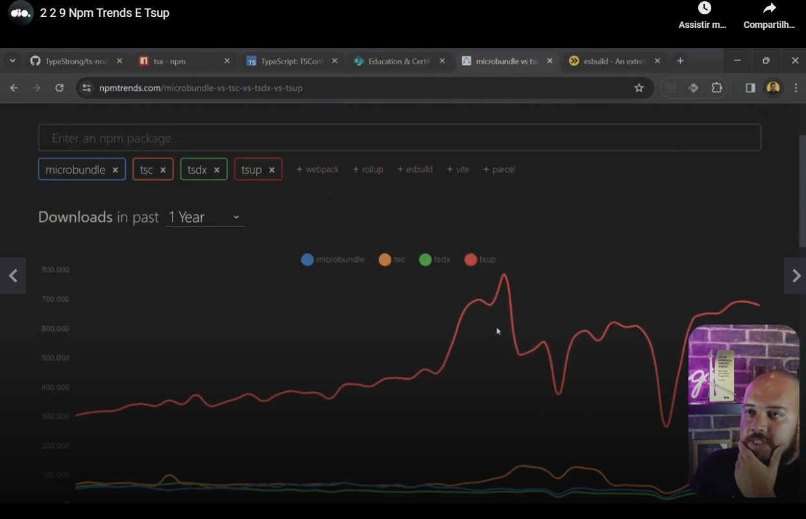

# Installation

Remember that your code will be transpilled, so you can install type script using the flag '-D':

```
npm install -D typescript
```


# Type inference

TypeScript can know the type of a variable by inference.



And as you can see in the previous image, one type a type is infered, it can not be changed. In other words, you can't pass as example a number to a string variable (do not mind if the type was inferred).


# npx tsc

You can execute a transpilation process through tsc, as example:

```
npx tsc src/index.ts
```

Will be created the file index.js in the directory 'src'.


# Teacher suggestion to do the transpilation and execution process with only one command



OBS: From the previous image the teacher executed the command `npm run start:dev`.


# Generating tsconfig

```
npx tsc --init
```


# Basic (clean) tsconfig




# Suggested tsconfig options

(under the node "compilerOptions"):

- **target**: ES6; 
- **module**: CommonJS (to compatibility);
- **outDir**: ./dist
- **strict**: true (enable stric type);
- **esModuleInterop**: true (compatibility to ES modules);


# Details on mouse over (VSCode)




# Transpiling all files of the project

Teacher gave an example: when running `npx tsc` without specifying a path, the file tscofing was readed and used the previous passed options (example destination folder), **several** javascript files was generated, each corresponding to a TypeScript file.


# Executing typescript files directly without specifying the transpile step

Teacher used the package **tsx** (he installed it with npm), see the script start:dev in the next image:



As you expect, teacher executed this package with the NPM script 'start:dev'.

You can also watch like warching in Node.JS:




# Documentation of tsconfig

Teacher suggested us to access [this link](https://www.typescriptlang.org/tsconfig/) to see the options to configure tsconfig.


# Minimal tsconfig

Teacher suggested this minimal configuration:




# Seeing hits on VSCode

You can see hints on VSCode putting the mouse over configurations:




# npmtrends.com and tsup



In the previous image you could see a graphic related to packages of the same are, transpilation process. Teacher suggested the tsup package to do the transpilation process. He said that the companies uses this package nd him more than the default package to do the transpilation process.
